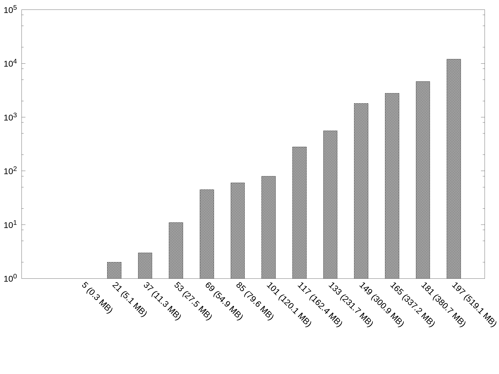
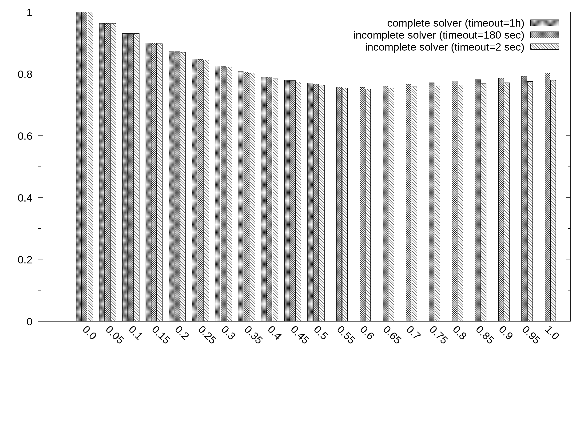
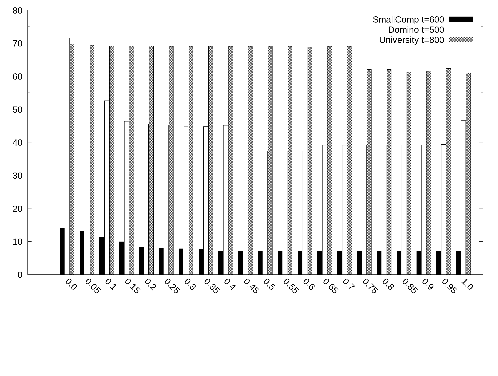
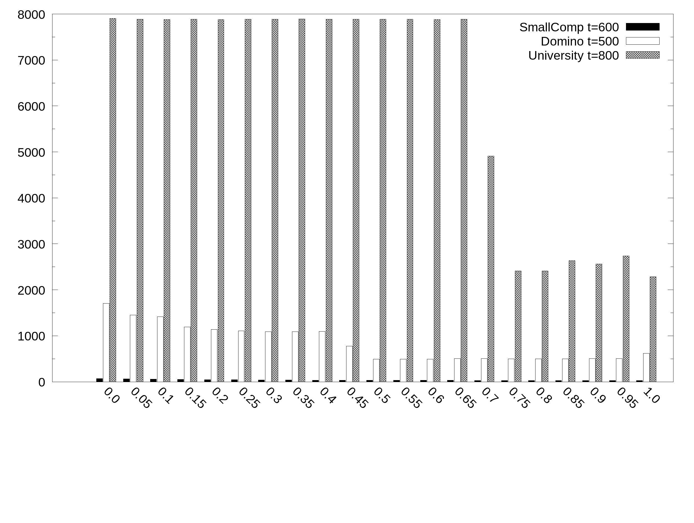
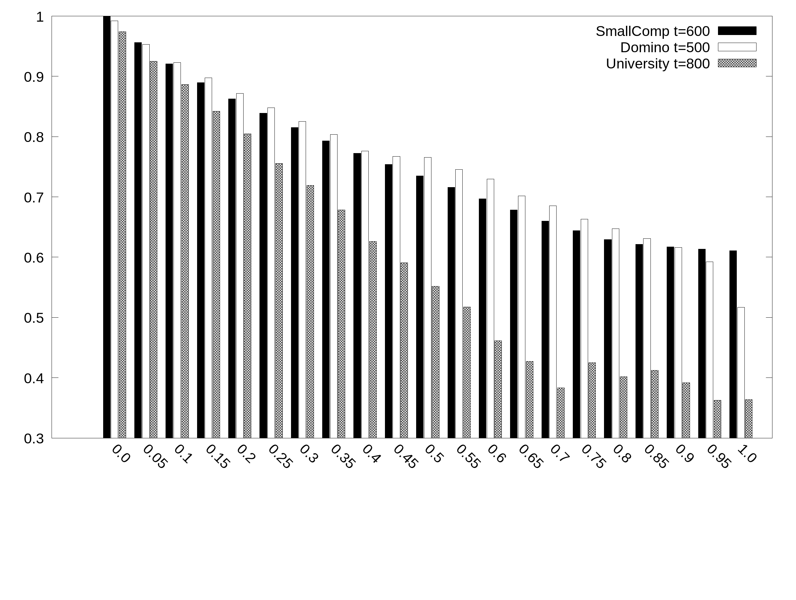
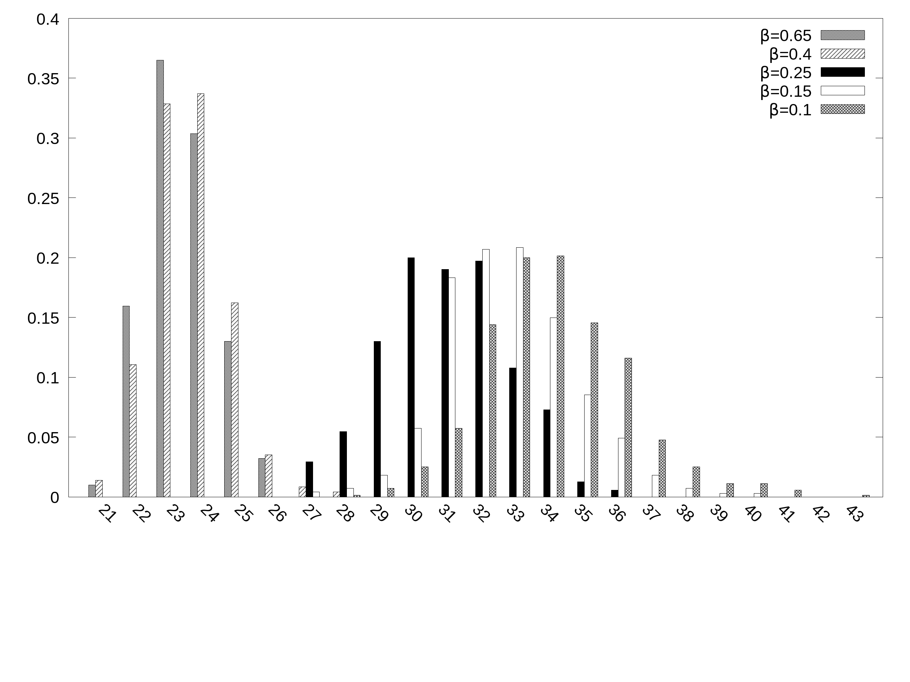

 This work is licensed under a <a rel="license" href="http://creativecommons.org/licenses/by/4.0/">Creative Commons Attribution 4.0 International License</a>.

# Parametric RBAC Maintenance via Max-SAT

This web site contains the dataset and experimental results partially illustrated within the manuscript "Parametric RBAC Maintenance via Max-SAT" which is currently under review to SACMAT Conference 2018.

# Datasets

## SmallComp

Dataset generated by simplyfing the paper working example to obtain optimal solution with a wide range of B values thus enabling the comparison with sub-otpimal solvers

|Input| Link|  	   
|:-:	           |:---:	|
|Permission-to-User | [UPA](dataset/SC/UPA.txt)|
|User-to-role      |[UA](dataset/SC/UA.txt)  |
|Permission-to-Role | [PA](dataset/SC/PA.txt) |
|Exception List           | [excs](dataset/SC/excs.txt)|

## Domino

Dataset benchmark used in Role-mining literature obtained from the user access profiles of the Lotus Domino Server.

|Input| Link|  	   
|:-:	           |:---:	|
|Permission-to-User | [UPA](dataset/D/UPA.txt)|
|User-to-role      |[UA](dataset/D/UA.txt)  |
|Permission-to-Role | [PA](dataset/D/PA.txt) |
|Exception List           | [excs](dataset/D/excs.txt)|

## University

Dataset benchmark used in Role-ming literature generated from a template at the Stony Brook University.

|Input| Link|  	   
|:-:	           |:---:	|
|Permission-to-User | [UPA](dataset/U/UPA.txt)|
|User-to-role      |[UA](dataset/U/UA.txt)  |
|Permission-to-Role | [PA](dataset/U/PA.txt) |
|Exception List           | [excs](dataset/U/excs.txt)|

## Firewall1

Dataset benchmark used in Role-ming literature representing policies implemented though firewalls used to provide external users access to internal resources.

|Input| Link|  	   
|:-:	           |:---:	|
|Permission-to-User | [UPA](dataset/F/UPA.txt)|
|User-to-role      |[UA](dataset/F/UA.txt)  |
|Permission-to-Role | [PA](dataset/F/PA.txt) |
|Exception List           | [excs](dataset/F/excs.txt)|

# Selection of a Max-SAT solver

## Complete Solvers

|Solver  	       |SmallComp  |Domino   	 |University   	|Firewall1   	|   	
|:-:	           |:---:	|:---:	|:---:	|:---:	|
|_Maximo_   	   |[B<=0.5](complete/SC/maximo/Results.txt)   	   |[B=0](complete/D/maximo/Results.txt)    	  |[B=0](complete/U/maximo/Results.txt)   	| [B=0](complete/F/maximo/Results.txt)   	|   	
|_MaxHS_   	     |[B<=0.4](complete/SC/maxhs/Results.txt)     	   |[B=0](complete/D/maxhs/Results.txt)   	      |[B=0](complete/U/maxhs/Results.txt)    	|  -  	|   	
|_LMHS_ |[B<=0.3](complete/SC/lmhs/Results.txt) | [B=0](complete/D/lmhs/Results.txt)   |  [B=0](complete/D/lmhs/Results.txt)  	|  - 	|   
|_Ahmaxsat_   	 |[B<=0.25](complete/SC/ahmaxsat/Results.txt)   	 |- | -  	|  - 	|   	

## Incomplete Solvers

### Time complexity based on Firewall1 variant

90 online fixing instances of increasing size have been generated from _Firewall1_ by selecting more and more of its users (i.e., rows); each instance is associated with a single exception to incorporate and generates a Max-SAT encoding of growing size.

|Number of users (CNF formula size)|UA|PA|exc|
|:---:|:---:|:---:|:---:|
|5 users (0.3 MB)|[UA](dataset/complexity/89/UA.txt)|[PA](dataset/complexity/89/PA.txt)|[exc](dataset/complexity/89/excs.txt)|
|21 users (5.1 MB)|[UA](dataset/complexity/85/UA.txt)|[PA](dataset/complexity/85/PA.txt)|[exc](dataset/complexity/85/excs.txt)|
|37 users (11.3 MB)|[UA](dataset/complexity/81/UA.txt)|[PA](dataset/complexity/81/PA.txt)|[exc](dataset/complexity/81/excs.txt)|
|53 users (27.5 MB)|[UA](dataset/complexity/77/UA.txt)|[PA](dataset/complexity/77/PA.txt)|[exc](dataset/complexity/77/excs.txt)|
|69 users (54.9 MB)|[UA](dataset/complexity/73/UA.txt)|[PA](dataset/complexity/73/PA.txt)|[exc](dataset/complexity/73/excs.txt)|
|85 users (79.6 MB)|[UA](dataset/complexity/69/UA.txt)|[PA](dataset/complexity/69/PA.txt)|[exc](dataset/complexity/69/excs.txt)|
|101 users (120.1 MB)|[UA](dataset/complexity/65/UA.txt)|[PA](dataset/complexity/65/PA.txt)|[exc](dataset/complexity/65/excs.txt)|
|117 users (162.4 MB)|[UA](dataset/complexity/61/UA.txt)|[PA](dataset/complexity/61/PA.txt)|[exc](dataset/complexity/61/excs.txt)|
|133 users (231.7 MB)|[UA](dataset/complexity/57/UA.txt)|[PA](dataset/complexity/57/PA.txt)|[exc](dataset/complexity/57/excs.txt)|
|149 users (300.9 MB)|[UA](dataset/complexity/53/UA.txt)|[PA](dataset/complexity/53/PA.txt)|[exc](dataset/complexity/53/excs.txt)|
|165 users (337.2 MB)|[UA](dataset/complexity/49/UA.txt)|[PA](dataset/complexity/49/PA.txt)|[exc](dataset/complexity/49/excs.txt)|
|181 users (380.7 MB)|[UA](dataset/complexity/45/UA.txt)|[PA](dataset/complexity/45/PA.txt)|[exc](dataset/complexity/45/excs.txt)|
|197 users (519.1 MB)|[UA](dataset/complexity/41/UA.txt)|[PA](dataset/complexity/41/PA.txt)|[exc](dataset/complexity/41/excs.txt)|

The following figure shows the minimum timeout needed (y axis) to obtain a feasible solution for these inputs as a function of their size (x axis) with [B=0.8](complexity/Results.txt).

### Quality of incomplete solutions

Experiment based on _SmallComp_ dataset to measure the ability of the incomplete solver adopted to satisfy the soft constraints. In particular, this is computed as the average weight of satisfied soft constraints over the total sum of weights for the 12 exceptions.

Average percentage of satisfied soft clauses (y axis) as a function of the balance B (x_axis) in the _SmallComp_ dataset:

Results are also available in plain text in [rates.txt](qualityIncompleteMaintenance/rates.txt) which are based on the evalaution of the three configurations:
- complete solver [Results_Complete.txt](qualityIncompleteMaintenance/Results.txt)
- incomplete solver (timeout 2 sec) [Results_t=2.txt](qualityIncompleteMaintenance/2/Results.txt)
- incomplete solver (timeout 180 sec) [Results_t=180.txt](qualityIncompleteMaintenance//180/Results.txt)

# Experimental Results

## Impact of Beta

By adopting CCEHC Max-SAT solver we asses experimentally the impact of balance B to **sim** (similarity) and **opt** (simplicity) for three dataset.

- [SmallComp](preferencesImpactMaintenance/SmallComp_AVG_Quality.dat)
- [Domino](preferencesImpactMaintenance/Domino_AVG_Quality.dat)
- [University](preferencesImpactMaintenance/University_AVG_Quality.dat)

Average similarity and simplicity (y axis) as a function of the balance B (x axis) with 21 values of B sampled at regular intervals:

Average number of roles (y axis) after incorporating exceptions as a function of the balance B (x axis) for different dataset:

Average number of assignments (y axis) depending on the balance B (x axis):

Average percentage of satisfied weights (y axis) depending on the balance B (x axis):

## Impact of timeout

Results collected in the following are obtained starting from _Domino_ to show the impact of the timeout with three different balance configurations:

- [B = 0.65](timeImpactMaintenance/AVG_Quality_b0.65.dat)
- [B = 0.45](timeImpactMaintenance/AVG_Quality_b0.45.dat)
- [B = 0.25](timeImpactMaintenance/AVG_Quality_b0.25.dat)
- [B = 0.10](timeImpactMaintenance/AVG_Quality_b0.1.dat)
- [B = 0.05](timeImpactMaintenance/AVG_Quality_b0.05.dat)

Average simplicity in Domino (y axis) as a function of the timeout (x axis, secs) at different balance points B.

Average similarity in Domino (y axis) as a function of the timeout (x axis, secs) at different balance points B.

Average number of roles in Domino (y axis) as a function of the timeout (x axis, secs) at different balance points B.

Average number of assignments in Domino (y axis) as a function of the timeout (x axis, secs) at different balance points B.

## The order of exceptions with a variant of _Domino_ dataset

We picked a string of 6 exceptions to be incorporated.

|Input| Link|  	   
|:-:	           |:---:	|
|Permission-to-User | [UPA](dataset/permutations/UPA.txt)|
|User-to-role      |[UA](dataset/permutations/UA.txt)  |
|Permission-to-Role | [PA](dataset/permutations/PA.txt) |
|Exception List           | [excs](dataset/permutations/excs.txt)|

We generated all the 720 permutations as possibly different incorporating sequences. We fix each sequence and collected at each our metrics (715/720 paths considered as solvable in less than 60 seconds).

In the following is reported the distribution of the final number of roles obtained at different B values.

Corresponding input data are also available in the following:

- [B = 0.65](permutazioniMaintenance/0.65/RolesOcc_0.65_timeout_10.dat)
- [B = 0.4](permutazioniMaintenance/0.4/RolesOcc_0.4_timeout_10.dat)
- [B = 0.25](permutazioniMaintenance/0.25/RolesOcc_0.25_timeout_10.dat)
- [B = 0.15](permutazioniMaintenance/0.15/RolesOcc_0.15_timeout_10.dat)
- [B = 0.1](permutazioniMaintenance/0.1/RolesOcc_0.1_timeout_10.dat)

# License
 This work is licensed under a <a rel="license" href="http://creativecommons.org/licenses/by/4.0/">Creative Commons Attribution 4.0 International License</a>.

Images have been created by the means of a software with non-commercial license.

We are currently setting up a git-hub repository to host the “RBAC Maintance” Open Source software. Meanwhile we are available to distribute it upon reception of a simple request of interest sent to [appliedresearchteam@bancaditalia.it](mailto:appliedresearchteam@bancaditalia.it).
